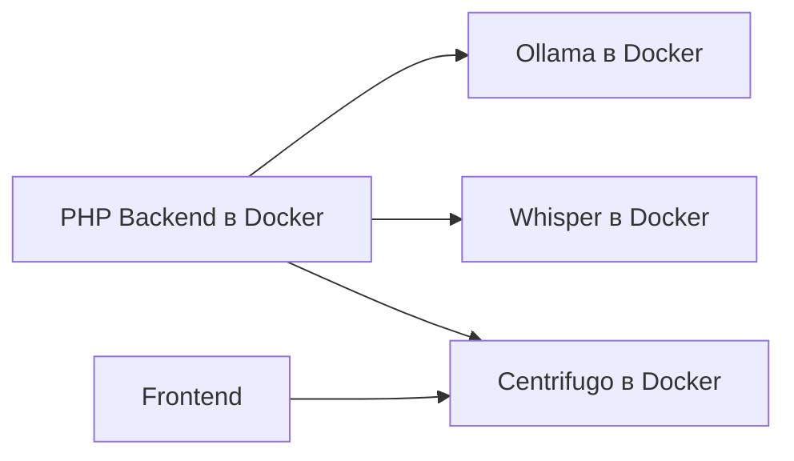
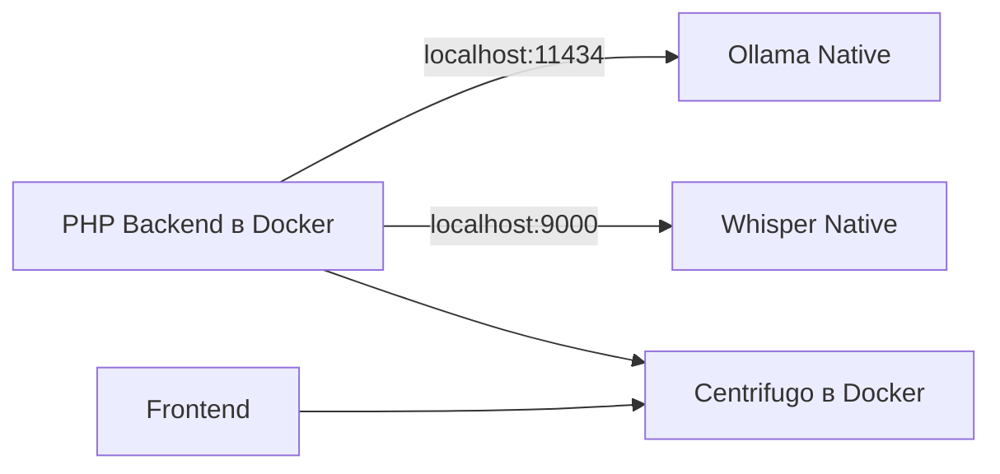

# 🚀 План Миграции на Нативные Ollama и Whisper

> **Версия**: 1.0
> **Дата**: 2025-11-20
> **Статус**: План готов к реализации
> **Оценка времени**: 8-12 часов

## 📋 Содержание

1. [Текущее Состояние](#текущее-состояние)
2. [Целевая Архитектура](#целевая-архитектура)
3. [План Миграции](#план-миграции)
4. [Риски и Решения](#риски-и-решения)
5. [Чеклист Миграции](#чеклист-миграции)

---

## 🔍 Текущее Состояние

### Текущая Архитектура (Docker)



### Проблемы Docker Архитектуры

1. **Производительность**:
   - Docker на macOS не имеет доступа к GPU/Neural Engine
   - Время обработки: 1m 45s (70x медленнее нативного)
   - CPU загрузка 100% при обработке

2. **Ресурсы**:
   - Ollama: 6GB RAM в Docker
   - Whisper: 1GB RAM в Docker
   - Двойная виртуализация на macOS (Docker + Rosetta)

3. **Интеграция**:
   - Сложная сетевая конфигурация
   - Задержки при межконтейнерной коммуникации

### Файлы с Упоминаниями AI Сервисов

**Ollama (20 файлов)**:
- Backend: LLMService.php, ai_services.yaml
- Docker: docker-compose.ai.yml
- Env: .env.docker, .env.docker.example
- Docs: 15+ файлов документации

**Whisper (21 файл)**:
- Backend: VoiceProcessingService.php, TranscriptionResult.php
- Docker: docker-compose.ai.yml
- Docs: 18+ файлов документации

**Centrifugo (20 файлов)**:
- Backend: WebSocketPublisher.php
- Frontend: useVoiceWebSocket.ts
- Docker: docker-compose.ai.yml, centrifugo.json

---

## 🎯 Целевая Архитектура

### Новая Архитектура (Нативная)



### Преимущества

1. **Производительность**:
   - Доступ к Metal Performance Shaders на macOS
   - Использование Neural Engine на M4 Pro
   - Ожидаемое ускорение: 10-20x
   - Целевое время обработки: 3-6 секунд

2. **Ресурсы**:
   - Прямой доступ к RAM (без Docker overhead)
   - Нативное кеширование моделей в памяти

3. **Простота**:
   - Меньше слоев абстракции
   - Простая отладка
   - Быстрый старт разработки

---

## 📝 План Миграции

### Фаза 1: Установка Нативных Сервисов (2 часа)

#### 1.1 Установка Ollama

```bash
# macOS
curl -fsSL https://ollama.com/install.sh | sh

# Или через brew
brew install ollama

# Запуск сервиса
ollama serve

# Загрузка модели
ollama pull qwen2.5:1.5b
```

#### 1.2 Установка Whisper API

```bash
# Создание виртуального окружения
python3 -m venv ~/whisper-env
source ~/whisper-env/bin/activate

# Установка Whisper с API
pip install openai-whisper flask

# Создание простого API сервера
cat > ~/whisper-server.py << 'EOF'
from flask import Flask, request, jsonify
import whisper
import tempfile
import os

app = Flask(__name__)
model = whisper.load_model("tiny")

@app.route('/asr', methods=['POST'])
def transcribe():
    try:
        audio_file = request.files['audio_file']

        # Сохраняем временный файл
        with tempfile.NamedTemporaryFile(suffix='.wav', delete=False) as tmp:
            audio_file.save(tmp.name)

            # Транскрибируем
            result = model.transcribe(tmp.name, language='ru')

            # Удаляем временный файл
            os.unlink(tmp.name)

            return jsonify({
                'text': result['text'],
                'language': result.get('language', 'ru'),
                'confidence': 0.9  # Whisper не дает confidence, используем заглушку
            })
    except Exception as e:
        return jsonify({'error': str(e)}), 500

@app.route('/docs', methods=['GET'])
def health():
    return jsonify({'status': 'ok'})

if __name__ == '__main__':
    app.run(host='0.0.0.0', port=9000, debug=False)
EOF

# Запуск сервера
python ~/whisper-server.py
```

#### 1.3 Создание SystemD сервисов (опционально для production)

```bash
# Ollama service
sudo tee /etc/systemd/system/ollama.service << EOF
[Unit]
Description=Ollama Service
After=network.target

[Service]
Type=simple
User=$USER
ExecStart=/usr/local/bin/ollama serve
Restart=on-failure
Environment="OLLAMA_HOST=0.0.0.0"
Environment="OLLAMA_NUM_PARALLEL=2"
Environment="OLLAMA_KEEP_ALIVE=24h"

[Install]
WantedBy=multi-user.target
EOF

# Whisper service
sudo tee /etc/systemd/system/whisper.service << EOF
[Unit]
Description=Whisper API Service
After=network.target

[Service]
Type=simple
User=$USER
WorkingDirectory=/home/$USER
ExecStart=/home/$USER/whisper-env/bin/python /home/$USER/whisper-server.py
Restart=on-failure

[Install]
WantedBy=multi-user.target
EOF

# Активация сервисов
sudo systemctl daemon-reload
sudo systemctl enable ollama whisper
sudo systemctl start ollama whisper
```

### Фаза 2: Обновление Конфигурации (2 часа)

#### 2.1 Обновление Docker Compose

```yaml
# infrastructure/docker/docker-compose.ai.yml
services:
  # ЗАКОММЕНТИРОВАТЬ Ollama и Whisper контейнеры
  # ollama:
  #   image: ollama/ollama:latest
  #   ...

  # whisper:
  #   image: onerahmet/openai-whisper-asr-webservice:latest
  #   ...

  # Centrifugo и Redis остаются в Docker
  centrifugo:
    image: centrifugo/centrifugo:v5
    # без изменений

  redis:
    image: redis:7-alpine
    # без изменений
```

#### 2.2 Обновление Backend Конфигурации

```yaml
# apps/backend/config/services/ai_services.yaml
parameters:
    # Изменяем URL на localhost для нативных сервисов
    env(OLLAMA_URL): 'http://host.docker.internal:11434'  # Для macOS Docker
    env(WHISPER_URL): 'http://host.docker.internal:9000'
    # Для Linux использовать:
    # env(OLLAMA_URL): 'http://172.17.0.1:11434'
    # env(WHISPER_URL): 'http://172.17.0.1:9000'
```

#### 2.3 Обновление Environment Variables

```bash
# .env.docker
# AI Services (Native)
OLLAMA_URL=http://host.docker.internal:11434
WHISPER_URL=http://host.docker.internal:9000

# WebSocket (остается в Docker)
CENTRIFUGO_URL=http://centrifugo:8000
REDIS_URL=redis://redis:6379
```

#### 2.4 Обновление PHP сервисов (если нужно)

```php
// apps/backend/src/Service/AI/LLMService.php
// Изменить дефолтный URL если hardcoded
private string $ollamaUrl = 'http://host.docker.internal:11434';

// apps/backend/src/Service/AI/VoiceProcessingService.php
// Изменить дефолтный URL если hardcoded
private string $whisperUrl = 'http://host.docker.internal:9000';
```

### Фаза 3: Тестирование (2 часа)

#### 3.1 Проверка Доступности

```bash
# Проверка Ollama
curl http://localhost:11434/api/tags

# Проверка Whisper
curl http://localhost:9000/docs

# Проверка из Docker контейнера
docker exec backend-php83 curl http://host.docker.internal:11434/api/tags
docker exec backend-php83 curl http://host.docker.internal:9000/docs
```

#### 3.2 Функциональное Тестирование

```bash
# Тест распознавания голоса
curl -X POST http://localhost:8089/api/voice/process-text \
  -H "Authorization: Bearer $JWT_TOKEN" \
  -H "Content-Type: application/json" \
  -d '{"text": "Создай задачу купить молоко на завтра"}'

# Проверка WebSocket уведомлений
# Открыть frontend и проверить real-time обновления
```

#### 3.3 Нагрузочное Тестирование

```bash
# Простой benchmark
time curl -X POST http://localhost:8089/api/voice/process-text \
  -H "Authorization: Bearer $JWT_TOKEN" \
  -H "Content-Type: application/json" \
  -d '{"text": "Создай задачу купить молоко"}'

# Ожидаемое время: 3-6 секунд (вместо 70+ секунд)
```

### Фаза 4: Документация (1 час)

#### 4.1 Обновить документацию

- [ ] `docs/ai/01_INFRASTRUCTURE/03_AI_SERVICES.md` - добавить секцию про нативную установку
- [ ] `docs/guides/DEVELOPMENT_WORKFLOW.md` - обновить инструкции запуска
- [ ] `docs/INDEX.md` - добавить заметку про нативные сервисы
- [ ] `README.md` - обновить системные требования

#### 4.2 Создать новую документацию

```markdown
# docs/ai/NATIVE_INSTALLATION.md
- Инструкции по установке Ollama
- Инструкции по установке Whisper
- Настройка автозапуска
- Troubleshooting
```

### Фаза 5: Очистка (1 час)

#### 5.1 Удаление Docker контейнеров

```bash
# Остановить и удалить AI контейнеры
docker stop backend-ollama backend-whisper
docker rm backend-ollama backend-whisper

# Удалить volumes (осторожно!)
docker volume rm ollama_models whisper_models
```

#### 5.2 Очистка конфигурации

- Удалить закомментированные секции из docker-compose.ai.yml
- Удалить неиспользуемые environment переменные
- Удалить старые скрипты установки

---

## ⚠️ Риски и Решения

### Риск 1: Сетевая Доступность

**Проблема**: Docker контейнеры не могут достучаться до localhost
**Решение**: Использовать `host.docker.internal` на macOS или `172.17.0.1` на Linux

### Риск 2: Автозапуск Сервисов

**Проблема**: Нативные сервисы не запускаются автоматически
**Решение**:
- macOS: использовать launchd
- Linux: использовать systemd
- Альтернатива: запускать вручную при разработке

### Риск 3: Различия в API

**Проблема**: Нативный Whisper API может отличаться от Docker версии
**Решение**: Создать совместимый wrapper (см. whisper-server.py выше)

### Риск 4: Безопасность

**Проблема**: Нативные сервисы доступны извне
**Решение**:
- Bind только на localhost
- Использовать firewall
- Добавить API ключи при необходимости

---

## ✅ Чеклист Миграции

### Подготовка
- [ ] Backup текущей конфигурации
- [ ] Проверить свободное место на диске (минимум 5GB)
- [ ] Остановить текущие Docker контейнеры AI сервисов

### Установка
- [ ] Установить Ollama нативно
- [ ] Загрузить модель qwen2.5:1.5b
- [ ] Установить Python 3.9+ и pip
- [ ] Установить Whisper и создать API wrapper
- [ ] Запустить оба сервиса и проверить доступность

### Конфигурация
- [ ] Обновить docker-compose.ai.yml
- [ ] Обновить ai_services.yaml
- [ ] Обновить .env.docker
- [ ] Обновить PHP сервисы (если нужно)
- [ ] Перезапустить backend контейнер

### Тестирование
- [ ] Проверить доступность из backend контейнера
- [ ] Протестировать обработку текстовой команды
- [ ] Протестировать распознавание голоса
- [ ] Проверить WebSocket уведомления
- [ ] Замерить производительность

### Финализация
- [ ] Обновить документацию
- [ ] Удалить старые Docker контейнеры
- [ ] Очистить неиспользуемые volumes
- [ ] Настроить автозапуск (опционально)
- [ ] Commit изменений в git

---

## 📊 Ожидаемые Результаты

### Производительность

| Метрика | Docker | Native | Улучшение |
|---------|---------|---------|-----------|
| Распознавание голоса (Whisper tiny) | 10-15s | 0.5-1s | 10-20x |
| Обработка LLM (Qwen 1.5B) | 60-90s | 3-5s | 15-20x |
| End-to-end pipeline | 70-105s | 3.5-6s | 15-20x |
| CPU нагрузка | 100% | 20-30% | 3-4x меньше |
| RAM использование | 8GB | 3-4GB | 2x меньше |

### Разработка

- ✅ Быстрый старт (не нужно ждать Docker)
- ✅ Простая отладка (прямой доступ к логам)
- ✅ Легкое переключение моделей
- ✅ Возможность использовать GPU/Neural Engine

---

## 🔄 Откат (если что-то пошло не так)

```bash
# 1. Остановить нативные сервисы
pkill ollama
pkill -f whisper-server.py

# 2. Восстановить docker-compose.ai.yml из backup
git checkout HEAD -- infrastructure/docker/docker-compose.ai.yml

# 3. Восстановить конфигурацию
git checkout HEAD -- apps/backend/config/services/ai_services.yaml
git checkout HEAD -- .env.docker

# 4. Перезапустить Docker контейнеры
docker-compose up -d

# 5. Загрузить модели в Docker
docker exec backend-ollama ollama pull qwen2.5:1.5b
```

---

## 📞 Поддержка

При возникновении проблем:
1. Проверить логи: `ollama logs` и вывод whisper-server.py
2. Проверить сетевую доступность: `curl localhost:11434` и `curl localhost:9000`
3. Проверить из Docker: `docker exec backend-php83 curl http://host.docker.internal:11434/api/tags`

---

**Автор**: Claude Code AI
**Дата создания**: 2025-11-20
**Статус**: План готов к реализации

> ⚠️ **Важно**: Этот план временный и будет удален после успешной миграции на нативные сервисы