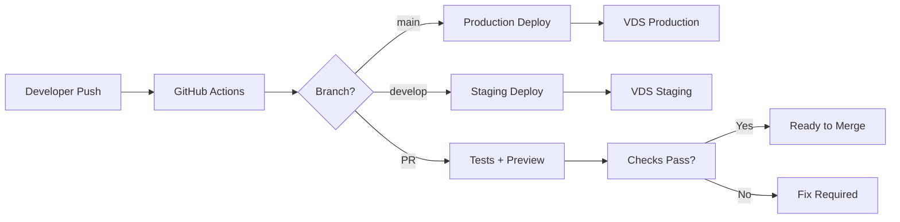

# 🚀 CI/CD Контекст для TaskFlow

> **Полный контекст проекта для настройки CI/CD pipeline**
> **Дата создания**: 2025-11-14
> **Автор**: Claude Code AI

---

## 📊 Анализ Текущего Состояния

### ✅ Что Уже Есть

#### 1. **Production Deployment**
- ✅ Полностью настроенный VDS (45.129.186.88)
- ✅ Docker контейнеризация (Backend + Frontend)
- ✅ HTTPS/SSL через Let's Encrypt (task.nesty.by, api.task.nesty.by)
- ✅ Автоматизированный скрипт деплоя (`scripts/deploy-production.sh`)
- ✅ Генератор секретов (`scripts/generate-secrets.sh`)
- ✅ Git hooks для code quality (`scripts/install-git-hooks.sh`)

#### 2. **Docker Инфраструктура**
- ✅ Модульная структура (base + dev/prod overrides)
- ✅ Fail-Fast принцип (production без fallback)
- ✅ Multi-stage build для frontend (1.5GB → 30MB)
- ✅ Health checks для всех сервисов
- ✅ Restart policies (unless-stopped)

#### 3. **Code Quality**
- ✅ PHP-CS-Fixer (PSR-12 стандарты)
- ✅ PHPStan (Level 5 статический анализ)
- ✅ PHPUnit тесты (33 файла, ~70% покрытие)
- ✅ Vitest для frontend (115 тестов)
- ✅ Pre-commit hooks

#### 4. **Технологический Стек**

**Backend:**
- Symfony 7.1 + PHP 8.3
- PostgreSQL 16
- RabbitMQ (очереди)
- JWT + Google OAuth 2.0
- Doctrine ORM 3.2

**Frontend:**
- Vue.js 3.4 + TypeScript 5.4
- Vite 5.1 (сборщик)
- Pinia 2.1 (state management)
- PrimeVue 3.50 (UI)
- PWA + Service Worker

**Инфраструктура:**
- Docker + Docker Compose v2
- Nginx (reverse proxy)
- Ubuntu 20.04 на VDS

---

## ❌ Что Отсутствует для CI/CD

### 1. **GitHub Actions Workflow**
- Нет `.github/workflows/*.yml` файлов
- Не настроена автоматическая сборка при push
- Нет автоматических тестов при PR
- Нет автоматического деплоя

### 2. **GitHub Secrets**
Не настроены секреты для:
- VDS доступа (SSH ключи)
- Docker Registry (если используется)
- Production credentials
- Telegram/Slack уведомлений

### 3. **Container Registry**
- Нет централизованного хранения образов
- Сборка происходит прямо на VDS
- Нет версионирования образов

### 4. **Staging Environment**
- Только dev и prod (нет staging)
- Нет возможности preview для PR

### 5. **Мониторинг и Уведомления**
- Нет автоматических уведомлений о деплое
- Нет health check мониторинга
- Нет логирования деплоев

---

## 🎯 План Внедрения CI/CD

### Фаза 1: Базовый CI (1-2 дня)

**Задачи:**
1. Создать `.github/workflows/ci.yml`
2. Настроить автоматические тесты при push/PR
3. Code quality checks (PHPStan, PHP-CS-Fixer, ESLint)
4. Build проверка (Docker build без push)
5. Security scanning (dependencies)

**Результат:** При каждом PR автоматически запускаются тесты и проверки

### Фаза 2: Container Registry (1 день)

**Задачи:**
1. Настроить GitHub Container Registry (ghcr.io)
2. Автоматическая сборка и push образов
3. Версионирование через tags
4. Очистка старых образов

**Результат:** Образы хранятся централизованно и версионированы

### Фаза 3: CD Pipeline (2-3 дня)

**Задачи:**
1. Создать `.github/workflows/deploy.yml`
2. Настроить SSH доступ к VDS через GitHub Secrets
3. Автоматический деплой при merge в main
4. Rollback механизм
5. Уведомления о статусе деплоя

**Результат:** Push в main = автоматический деплой на production

### Фаза 4: Staging Environment (2 дня)

**Задачи:**
1. Настроить staging.task.nesty.by
2. Отдельные контейнеры для staging
3. Автоматический деплой из develop ветки
4. Preview environments для PR

**Результат:** Возможность тестирования перед production

### Фаза 5: Мониторинг (1 день)

**Задачи:**
1. Настроить Telegram бота для уведомлений
2. Health check monitoring
3. Deployment history и логи
4. Rollback уведомления

**Результат:** Полная видимость процесса деплоя

---

## 🔧 Технические Детали

### Текущий Процесс Деплоя

```bash
# На локальной машине
git push origin main

# SSH на VDS
ssh user@45.129.186.88
cd /opt/taskflow
git pull origin main

# Запуск деплоя
./scripts/deploy-production.sh
```

### Будущий CI/CD Flow



### Environment Variables для CI/CD

**GitHub Secrets Требуемые:**

```yaml
# VDS Access
VDS_HOST: 45.129.186.88
VDS_USER: root
VDS_SSH_KEY: <private SSH key>

# Docker Registry
REGISTRY_USERNAME: <github username>
REGISTRY_TOKEN: <github PAT token>

# Production Secrets
PROD_POSTGRES_PASSWORD: <strong password>
PROD_RABBITMQ_PASSWORD: <strong password>
PROD_APP_SECRET: <symfony secret>
PROD_JWT_PASSPHRASE: <jwt secret>

# Notifications
TELEGRAM_BOT_TOKEN: <bot token>
TELEGRAM_CHAT_ID: <chat id>
```

### Структура GitHub Actions

```
.github/
├── workflows/
│   ├── ci.yml           # Continuous Integration
│   ├── deploy-prod.yml  # Production deployment
│   ├── deploy-stage.yml # Staging deployment
│   └── cleanup.yml      # Cleanup old artifacts
├── actions/
│   ├── setup/           # Reusable setup actions
│   └── deploy/          # Reusable deploy actions
└── dependabot.yml       # Dependency updates
```

---

## 📝 Критические Точки

### 1. **Безопасность**
- ⚠️ НИКОГДА не коммитить production credentials
- ⚠️ Использовать GitHub Secrets для sensitive данных
- ⚠️ Ограничить deployment только из protected branches
- ⚠️ Использовать environment approvals для production

### 2. **Performance**
- ⚠️ Кешировать Docker layers
- ⚠️ Параллелить тесты где возможно
- ⚠️ Использовать matrix builds для разных версий
- ⚠️ Оптимизировать размер Docker образов

### 3. **Reliability**
- ⚠️ Всегда иметь rollback план
- ⚠️ Blue-green deployment для zero downtime
- ⚠️ Health checks перед switch traffic
- ⚠️ Backup БД перед миграциями

---

## 🚀 Quick Start для CI/CD

### Шаг 1: Создать базовый CI workflow

```yaml
# .github/workflows/ci.yml
name: CI

on:
  push:
    branches: [ main, develop ]
  pull_request:
    branches: [ main ]

jobs:
  test-backend:
    runs-on: ubuntu-latest
    steps:
      - uses: actions/checkout@v3

      - name: Build Backend
        run: docker compose -f docker-compose.yml -f infrastructure/docker/docker-compose.test.yml build php83-fpm

      - name: Run PHPUnit
        run: docker compose -f docker-compose.yml -f infrastructure/docker/docker-compose.test.yml run --rm php83-fpm php bin/phpunit

      - name: Run PHPStan
        run: docker compose -f docker-compose.yml -f infrastructure/docker/docker-compose.test.yml run --rm php83-fpm vendor/bin/phpstan analyse

  test-frontend:
    runs-on: ubuntu-latest
    steps:
      - uses: actions/checkout@v3

      - name: Setup Node.js
        uses: actions/setup-node@v3
        with:
          node-version: '20'

      - name: Install dependencies
        working-directory: ./apps/frontend
        run: npm ci

      - name: Run tests
        working-directory: ./apps/frontend
        run: npm run test:run

      - name: Build
        working-directory: ./apps/frontend
        run: npm run build
```

### Шаг 2: Настроить GitHub Secrets

1. Перейти в Settings → Secrets → Actions
2. Добавить все необходимые секреты
3. Настроить environment protection rules

### Шаг 3: Создать deployment workflow

```yaml
# .github/workflows/deploy.yml
name: Deploy to Production

on:
  push:
    branches: [ main ]

jobs:
  deploy:
    runs-on: ubuntu-latest
    environment: production

    steps:
      - uses: actions/checkout@v3

      - name: Deploy to VDS
        uses: appleboy/ssh-action@v0.1.5
        with:
          host: ${{ secrets.VDS_HOST }}
          username: ${{ secrets.VDS_USER }}
          key: ${{ secrets.VDS_SSH_KEY }}
          script: |
            cd /opt/taskflow
            git pull origin main
            ./scripts/deploy-production.sh

      - name: Send Telegram notification
        if: always()
        uses: appleboy/telegram-action@v0.1.1
        with:
          to: ${{ secrets.TELEGRAM_CHAT_ID }}
          token: ${{ secrets.TELEGRAM_BOT_TOKEN }}
          message: |
            🚀 Deployment Status: ${{ job.status }}
            📦 Repository: ${{ github.repository }}
            🔧 Branch: ${{ github.ref }}
            👤 Actor: ${{ github.actor }}
```

---

## 📊 Метрики Успеха

После внедрения CI/CD:

| Метрика | До CI/CD | После CI/CD | Улучшение |
|---------|----------|-------------|-----------|
| Время деплоя | 15-20 мин (ручной) | 3-5 мин (авто) | 75% ⬇️ |
| Частота деплоев | 1-2/неделя | 5-10/неделя | 400% ⬆️ |
| Failed deployments | ~10% | <2% | 80% ⬇️ |
| Rollback время | 30 мин | 2 мин | 93% ⬇️ |
| Test coverage | Manual | Automatic | 100% ✅ |

---

## 📚 Ресурсы

### Документация
- [GitHub Actions](https://docs.github.com/en/actions)
- [Docker Hub](https://docs.docker.com/docker-hub/)
- [GitHub Container Registry](https://docs.github.com/en/packages)

### Инструменты
- [act](https://github.com/nektos/act) - локальное тестирование GitHub Actions
- [docker-compose-wait](https://github.com/ufoscout/docker-compose-wait) - ожидание готовности сервисов
- [hadolint](https://github.com/hadolint/hadolint) - линтер для Dockerfile

### Примеры
- [Laravel CI/CD](https://github.com/laravel/framework/blob/master/.github/workflows/tests.yml)
- [Vue.js CI/CD](https://github.com/vuejs/vue-next/blob/master/.github/workflows/ci.yml)

---

## ✅ Чеклист Готовности

Перед началом настройки CI/CD убедитесь:

- [ ] Есть доступ к GitHub репозиторию с правами admin
- [ ] Есть SSH доступ к production VDS
- [ ] Настроен Docker на VDS
- [ ] Работает текущий deployment процесс
- [ ] Есть backup production данных
- [ ] Определены environments (dev, staging, prod)
- [ ] Есть план rollback
- [ ] Настроены уведомления (Telegram/Slack)

---

**Этот документ - полный контекст для настройки CI/CD pipeline для проекта TaskFlow.**