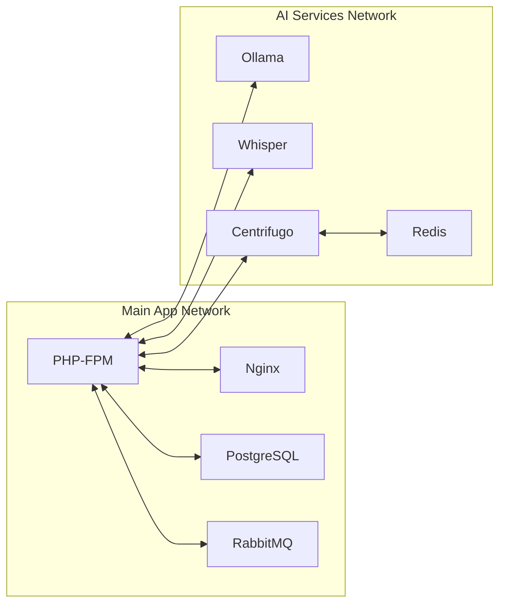

# 🐳 Phase 1.2: Docker Configuration Guide

> **Document Version**: 1.0.0
> **Last Updated**: 2025-11-08
> **Estimated Time**: 1 day
> **Complexity**: MEDIUM
> **Prerequisites**: Docker basics, YAML understanding

## 📋 Table of Contents

1. [Docker Architecture Overview](#docker-architecture-overview)
2. [Development Configuration](#development-configuration)
3. [Production Configuration](#production-configuration)
4. [Network Configuration](#network-configuration)
5. [Volume Management](#volume-management)
6. [Resource Limits](#resource-limits)
7. [Multi-Stage Builds](#multi-stage-builds)
8. [Optimization Techniques](#optimization-techniques)

---

## 🏗️ Docker Architecture Overview

### Service Topology

```yaml
Architecture:
  Main Application:
    - backend-php83 (Symfony)
    - backend-nginx
    - backend-psql16
    - backend-rabbitmq

  AI Services (Separate):
    - voice-ai-ollama (LLM)
    - voice-ai-whisper (STT)
    - voice-ai-centrifugo (WebSocket)
    - voice-ai-redis (Cache/PubSub)

  Networks:
    - backend-network (main app)
    - voice-ai-network (AI services)
    - bridge-network (inter-communication)
```

### Communication Flow



---

## 🚀 Development Configuration

### Main docker-compose.dev.yml

```yaml
# File: ~/voice-ai-services/docker-compose.dev.yml
# Development configuration with hot-reload and debugging

version: '3.8'

x-common-variables: &common-variables
  TZ: Europe/Moscow
  ENVIRONMENT: development

x-logging: &default-logging
  driver: "json-file"
  options:
    max-size: "10m"
    max-file: "3"
    labels: "service"

networks:
  voice-ai-dev:
    driver: bridge
    enable_ipv6: false
    ipam:
      driver: default
      config:
        - subnet: 172.21.0.0/16

volumes:
  ollama-dev-data:
    driver: local
  whisper-dev-models:
    driver: local
  audio-dev-uploads:
    driver: local
  redis-dev-data:
    driver: local

services:
  # Development Ollama with extended logging
  ollama-dev:
    image: ollama/ollama:latest
    container_name: voice-ai-ollama-dev
    hostname: ollama-dev
    restart: unless-stopped
    ports:
      - "11434:11434"
    volumes:
      - ollama-dev-data:/root/.ollama
      - ./configs/ollama:/config:ro
      - ./logs/ollama:/logs
      - ./scripts/ollama:/scripts:ro
    environment:
      <<: *common-variables
      OLLAMA_HOST: 0.0.0.0
      OLLAMA_KEEP_ALIVE: 5m
      OLLAMA_NUM_PARALLEL: 2
      OLLAMA_MAX_LOADED_MODELS: 1
      OLLAMA_DEBUG: 1
      OLLAMA_VERBOSE: 1
    networks:
      voice-ai-dev:
        ipv4_address: 172.21.0.10
        aliases:
          - ollama.voice.local
    logging: *default-logging
    deploy:
      resources:
        limits:
          cpus: '2'
          memory: 3G
        reservations:
          cpus: '1'
          memory: 2G
    healthcheck:
      test: ["CMD", "curl", "-f", "http://localhost:11434/api/tags"]
      interval: 30s
      timeout: 10s
      retries: 3
      start_period: 60s
    labels:
      - "traefik.enable=false"
      - "com.voice-ai.service=ollama"
      - "com.voice-ai.environment=development"

  # Development Whisper with debugging
  whisper-dev:
    build:
      context: ./configs/whisper
      dockerfile: Dockerfile.dev
      target: development
      args:
        - WHISPER_VERSION=1.5.4
        - MODEL_SIZE=base
        - ENABLE_DEBUG=true
    image: voice-ai/whisper:dev
    container_name: voice-ai-whisper-dev
    hostname: whisper-dev
    restart: unless-stopped
    ports:
      - "8090:8090"
      - "5678:5678"  # Python debugger port
    volumes:
      - whisper-dev-models:/models
      - audio-dev-uploads:/uploads
      - ./logs/whisper:/logs
      - ./configs/whisper/app.py:/app/app.py:ro  # Hot reload
    environment:
      <<: *common-variables
      MODEL_SIZE: base
      LANGUAGE: ru
      THREADS: 4
      MAX_DURATION: 30
      FLASK_ENV: development
      FLASK_DEBUG: 1
      PYTHONUNBUFFERED: 1
    networks:
      voice-ai-dev:
        ipv4_address: 172.21.0.11
        aliases:
          - whisper.voice.local
    logging: *default-logging
    deploy:
      resources:
        limits:
          cpus: '1'
          memory: 1G
        reservations:
          cpus: '0.5'
          memory: 512M
    healthcheck:
      test: ["CMD", "curl", "-f", "http://localhost:8090/health"]
      interval: 30s
      timeout: 5s
      retries: 3

  # Development Redis with persistence
  redis-dev:
    image: redis:7.2-alpine
    container_name: voice-ai-redis-dev
    hostname: redis-dev
    restart: unless-stopped
    ports:
      - "6379:6379"
    volumes:
      - redis-dev-data:/data
      - ./configs/redis/redis.conf:/usr/local/etc/redis/redis.conf:ro
    environment:
      <<: *common-variables
      REDIS_PASSWORD: dev-password
    command: redis-server /usr/local/etc/redis/redis.conf
    networks:
      voice-ai-dev:
        ipv4_address: 172.21.0.12
        aliases:
          - redis.voice.local
    logging: *default-logging
    deploy:
      resources:
        limits:
          cpus: '0.5'
          memory: 512M
        reservations:
          cpus: '0.25'
          memory: 256M
    healthcheck:
      test: ["CMD", "redis-cli", "--raw", "incr", "ping"]
      interval: 30s
      timeout: 3s
      retries: 3

  # Development Centrifugo with debug UI
  centrifugo-dev:
    image: centrifugo/centrifugo:v5
    container_name: voice-ai-centrifugo-dev
    hostname: centrifugo-dev
    restart: unless-stopped
    ports:
      - "8000:8000"  # WebSocket endpoint
      - "8001:8001"  # Admin panel
      - "9090:9090"  # Prometheus metrics
    volumes:
      - ./configs/centrifugo/config.dev.json:/centrifugo/config.json:ro
      - ./logs/centrifugo:/logs
    command: centrifugo -c /centrifugo/config.json --log_level=debug --admin --health
    depends_on:
      redis-dev:
        condition: service_healthy
    networks:
      voice-ai-dev:
        ipv4_address: 172.21.0.13
        aliases:
          - ws.voice.local
    logging: *default-logging
    environment:
      <<: *common-variables
      CENTRIFUGO_REDIS_ADDRESS: redis-dev:6379
      CENTRIFUGO_REDIS_PASSWORD: dev-password
    healthcheck:
      test: ["CMD", "wget", "--spider", "-q", "http://localhost:8000/health"]
      interval: 30s
      timeout: 5s
      retries: 3

  # Development monitoring stack
  prometheus:
    image: prom/prometheus:latest
    container_name: voice-ai-prometheus
    restart: unless-stopped
    ports:
      - "9091:9090"
    volumes:
      - ./configs/prometheus/prometheus.yml:/etc/prometheus/prometheus.yml:ro
      - prometheus-data:/prometheus
    command:
      - '--config.file=/etc/prometheus/prometheus.yml'
      - '--storage.tsdb.path=/prometheus'
      - '--web.console.libraries=/etc/prometheus/console_libraries'
      - '--web.console.templates=/etc/prometheus/consoles'
      - '--web.enable-lifecycle'
    networks:
      voice-ai-dev:
        ipv4_address: 172.21.0.20
    profiles:
      - monitoring

  grafana:
    image: grafana/grafana:latest
    container_name: voice-ai-grafana
    restart: unless-stopped
    ports:
      - "3001:3000"
    volumes:
      - grafana-data:/var/lib/grafana
      - ./configs/grafana/dashboards:/etc/grafana/provisioning/dashboards:ro
      - ./configs/grafana/datasources:/etc/grafana/provisioning/datasources:ro
    environment:
      - GF_SECURITY_ADMIN_USER=admin
      - GF_SECURITY_ADMIN_PASSWORD=admin
      - GF_INSTALL_PLUGINS=redis-datasource
    networks:
      voice-ai-dev:
        ipv4_address: 172.21.0.21
    depends_on:
      - prometheus
    profiles:
      - monitoring

volumes:
  prometheus-data:
    driver: local
  grafana-data:
    driver: local
```

### Whisper Development Dockerfile

```dockerfile
# File: ~/voice-ai-services/configs/whisper/Dockerfile.dev

# Multi-stage build for development
FROM python:3.11-slim as base

# Install system dependencies
RUN apt-get update && apt-get install -y \
    ffmpeg \
    git \
    curl \
    build-essential \
    && rm -rf /var/lib/apt/lists/*

# Development stage
FROM base as development

# Install development tools
RUN pip install --no-cache-dir \
    debugpy \
    ipython \
    pytest \
    pytest-asyncio \
    pytest-cov \
    black \
    flake8 \
    mypy

# Install Whisper and dependencies
ARG WHISPER_VERSION=1.5.4
RUN pip install --no-cache-dir \
    openai-whisper==${WHISPER_VERSION} \
    fastapi \
    uvicorn[standard] \
    python-multipart \
    aiofiles \
    prometheus-client \
    watchdog  # For auto-reload

# Create directories
RUN mkdir -p /app /models /uploads /logs

# Copy application code
COPY app.py /app/app.py
COPY dev_server.py /app/dev_server.py

# Download model at build time
ARG MODEL_SIZE=base
RUN python -c "import whisper; whisper.load_model('${MODEL_SIZE}', download_root='/models')"

WORKDIR /app

# Enable Python debugger
ENV PYTHONDONTWRITEBYTECODE=1
ENV PYTHONUNBUFFERED=1

# Run with auto-reload for development
CMD ["python", "dev_server.py"]
```

---

## 🏭 Production Configuration

### Production docker-compose.prod.yml

```yaml
# File: ~/voice-ai-services/docker-compose.prod.yml
# Production configuration with security and optimization

version: '3.8'

x-restart-policy: &restart-policy
  restart: always
  restart_policy:
    condition: on-failure
    delay: 5s
    max_attempts: 3
    window: 120s

networks:
  voice-ai-prod:
    driver: overlay
    attachable: true
    encrypted: true
    ipam:
      config:
        - subnet: 10.1.0.0/24

secrets:
  redis_password:
    file: ./secrets/redis_password.txt
  centrifugo_secret:
    file: ./secrets/centrifugo_secret.txt
  centrifugo_api_key:
    file: ./secrets/centrifugo_api_key.txt

configs:
  ollama_config:
    file: ./configs/ollama/config.prod.json
  whisper_config:
    file: ./configs/whisper/config.prod.yml
  centrifugo_config:
    file: ./configs/centrifugo/config.prod.json
  redis_config:
    file: ./configs/redis/redis.prod.conf

services:
  ollama-prod:
    image: ollama/ollama:v0.1.29  # Fixed version for production
    <<: *restart-policy
    deploy:
      replicas: 1
      update_config:
        parallelism: 1
        delay: 10s
        failure_action: rollback
        monitor: 60s
      restart_policy:
        condition: any
        delay: 5s
        max_attempts: 3
      resources:
        limits:
          cpus: '2'
          memory: 3G
        reservations:
          cpus: '1'
          memory: 2G
      placement:
        constraints:
          - node.role == worker
          - node.labels.ai == true
    networks:
      - voice-ai-prod
    volumes:
      - type: volume
        source: ollama-prod-data
        target: /root/.ollama
      - type: tmpfs
        target: /tmp
        tmpfs:
          size: 500M
    environment:
      OLLAMA_HOST: 0.0.0.0
      OLLAMA_KEEP_ALIVE: 5m
      OLLAMA_NUM_PARALLEL: 2
      OLLAMA_MAX_LOADED_MODELS: 1
    configs:
      - source: ollama_config
        target: /config/config.json
    healthcheck:
      test: ["CMD", "curl", "-f", "http://localhost:11434/api/tags"]
      interval: 30s
      timeout: 10s
      retries: 5
      start_period: 60s
    logging:
      driver: "json-file"
      options:
        max-size: "50m"
        max-file: "10"
        labels: "service,environment,version"
    labels:
      - "com.voice-ai.service=ollama"
      - "com.voice-ai.environment=production"
      - "com.voice-ai.version=0.1.29"

  whisper-prod:
    image: voice-ai/whisper:1.5.4-prod
    <<: *restart-policy
    deploy:
      replicas: 2  # Multiple instances for load balancing
      update_config:
        parallelism: 1
        delay: 10s
        failure_action: rollback
      restart_policy:
        condition: any
        delay: 5s
      resources:
        limits:
          cpus: '1'
          memory: 1G
        reservations:
          cpus: '0.5'
          memory: 512M
      placement:
        constraints:
          - node.labels.ai == true
    networks:
      - voice-ai-prod
    volumes:
      - whisper-prod-models:/models:ro
      - audio-prod-uploads:/uploads
      - type: tmpfs
        target: /tmp
        tmpfs:
          size: 200M
    environment:
      MODEL_SIZE: base
      LANGUAGE: ru
      THREADS: 4
      MAX_DURATION: 30
      WORKERS: 2
    configs:
      - source: whisper_config
        target: /app/config.yml
    healthcheck:
      test: ["CMD", "curl", "-f", "http://localhost:8090/health"]
      interval: 30s
      timeout: 5s
      retries: 3

  redis-prod:
    image: redis:7.2-alpine
    <<: *restart-policy
    deploy:
      replicas: 1
      update_config:
        parallelism: 1
        delay: 10s
      resources:
        limits:
          cpus: '0.5'
          memory: 512M
        reservations:
          cpus: '0.25'
          memory: 256M
    networks:
      - voice-ai-prod
    volumes:
      - redis-prod-data:/data
    secrets:
      - redis_password
    configs:
      - source: redis_config
        target: /usr/local/etc/redis/redis.conf
    command: redis-server /usr/local/etc/redis/redis.conf
    healthcheck:
      test: ["CMD", "redis-cli", "--raw", "incr", "ping"]
      interval: 30s
      timeout: 3s
      retries: 3

  centrifugo-prod:
    image: centrifugo/centrifugo:v5.0.0
    <<: *restart-policy
    deploy:
      replicas: 2
      update_config:
        parallelism: 1
        delay: 10s
      resources:
        limits:
          cpus: '1'
          memory: 1G
        reservations:
          cpus: '0.5'
          memory: 512M
    networks:
      - voice-ai-prod
    secrets:
      - centrifugo_secret
      - centrifugo_api_key
      - redis_password
    configs:
      - source: centrifugo_config
        target: /centrifugo/config.json
    command: centrifugo -c /centrifugo/config.json
    healthcheck:
      test: ["CMD", "wget", "--spider", "-q", "http://localhost:8000/health"]
      interval: 30s
      timeout: 5s
      retries: 3

  # Nginx Load Balancer
  nginx-lb:
    image: nginx:alpine
    <<: *restart-policy
    deploy:
      replicas: 1
      placement:
        constraints:
          - node.role == manager
    ports:
      - target: 80
        published: 80
        protocol: tcp
        mode: host
      - target: 443
        published: 443
        protocol: tcp
        mode: host
    networks:
      - voice-ai-prod
    volumes:
      - ./configs/nginx/nginx.prod.conf:/etc/nginx/nginx.conf:ro
      - ./certs:/etc/nginx/certs:ro
    depends_on:
      - ollama-prod
      - whisper-prod
      - centrifugo-prod

volumes:
  ollama-prod-data:
    driver: local
    driver_opts:
      type: none
      o: bind
      device: /mnt/voice-ai/ollama
  whisper-prod-models:
    driver: local
    driver_opts:
      type: none
      o: bind
      device: /mnt/voice-ai/whisper
  audio-prod-uploads:
    driver: local
    driver_opts:
      type: none
      o: bind
      device: /mnt/voice-ai/uploads
  redis-prod-data:
    driver: local
    driver_opts:
      type: none
      o: bind
      device: /mnt/voice-ai/redis
```

---

## 🌐 Network Configuration

### Custom Bridge Network

```yaml
# File: ~/voice-ai-services/configs/network/bridge.yml

version: '3.8'

networks:
  # Development network
  voice-ai-dev:
    driver: bridge
    enable_ipv6: false
    ipam:
      driver: default
      config:
        - subnet: 172.21.0.0/16
          gateway: 172.21.0.1
          ip_range: 172.21.0.0/24
          aux_addresses:
            host: 172.21.0.254
    driver_opts:
      com.docker.network.bridge.name: br-voice-ai
      com.docker.network.bridge.enable_icc: "true"
      com.docker.network.bridge.enable_ip_masquerade: "true"
      com.docker.network.bridge.host_binding_ipv4: "0.0.0.0"
      com.docker.network.driver.mtu: "1500"
    labels:
      - "com.voice-ai.network=development"

  # Production overlay network
  voice-ai-prod:
    driver: overlay
    attachable: true
    encrypted: true
    ipam:
      driver: default
      config:
        - subnet: 10.1.0.0/24
          gateway: 10.1.0.1
    driver_opts:
      encrypted: "true"
      com.docker.network.driver.mtu: "1450"
    labels:
      - "com.voice-ai.network=production"

  # External network for communication with main app
  external-bridge:
    external: true
    name: backend-network
```

### Network Security Rules

```bash
#!/bin/bash
# File: ~/voice-ai-services/scripts/setup-network-security.sh

# Create custom iptables rules for Docker networks

# Allow communication between containers in the same network
iptables -A DOCKER-USER -i br-voice-ai -o br-voice-ai -j ACCEPT

# Allow specific ports from outside
iptables -A DOCKER-USER -p tcp --dport 11434 -j ACCEPT  # Ollama
iptables -A DOCKER-USER -p tcp --dport 8090 -j ACCEPT   # Whisper
iptables -A DOCKER-USER -p tcp --dport 8000 -j ACCEPT   # Centrifugo

# Block everything else
iptables -A DOCKER-USER -j DROP

# Save rules
iptables-save > /etc/iptables/rules.v4
```

---

## 💾 Volume Management

### Volume Strategy

```yaml
# File: ~/voice-ai-services/configs/volumes/volume-config.yml

volumes:
  # Named volumes with drivers
  ollama-data:
    driver: local
    driver_opts:
      type: none
      o: bind
      device: /mnt/ai-storage/ollama
    labels:
      - "backup=daily"
      - "retention=7d"

  whisper-models:
    driver: local
    driver_opts:
      type: none
      o: bind
      device: /mnt/ai-storage/whisper
    labels:
      - "backup=weekly"
      - "retention=30d"

  # Temporary volume for uploads
  audio-uploads:
    driver: local-persist
    driver_opts:
      mountpoint: /tmp/voice-uploads
    labels:
      - "cleanup=hourly"
      - "max-size=1GB"
```

### Backup Script

```bash
#!/bin/bash
# File: ~/voice-ai-services/scripts/backup-volumes.sh

set -e

BACKUP_DIR="/backup/voice-ai"
DATE=$(date +%Y%m%d_%H%M%S)

# Create backup directory
mkdir -p ${BACKUP_DIR}/${DATE}

# Stop services
docker-compose stop

# Backup volumes
for volume in ollama-data whisper-models redis-data; do
    echo "Backing up ${volume}..."
    docker run --rm \
        -v voice-ai-services_${volume}:/source:ro \
        -v ${BACKUP_DIR}/${DATE}:/backup \
        alpine tar czf /backup/${volume}.tar.gz -C /source .
done

# Backup configurations
tar czf ${BACKUP_DIR}/${DATE}/configs.tar.gz configs/

# Start services
docker-compose start

# Clean old backups (keep last 7 days)
find ${BACKUP_DIR} -type d -mtime +7 -exec rm -rf {} \;

echo "Backup completed: ${BACKUP_DIR}/${DATE}"
```

---

## ⚡ Resource Limits

### Memory Limits Configuration

```yaml
# File: ~/voice-ai-services/configs/resources/limits.yml

# Development limits (generous)
development:
  ollama:
    memory: 4G
    memory_swap: 6G
    memory_reservation: 2G
    cpus: 2
    cpu_shares: 1024

  whisper:
    memory: 1G
    memory_swap: 2G
    memory_reservation: 512M
    cpus: 1
    cpu_shares: 512

  centrifugo:
    memory: 512M
    memory_swap: 1G
    memory_reservation: 256M
    cpus: 0.5
    cpu_shares: 256

  redis:
    memory: 512M
    memory_swap: 512M
    memory_reservation: 256M
    cpus: 0.5
    cpu_shares: 256

# Production limits (strict)
production:
  ollama:
    memory: 3G
    memory_swap: 3G  # No swap
    memory_reservation: 2.5G
    memory_swappiness: 0
    oom_kill_disable: false
    cpus: 1.5
    cpu_shares: 768
    cpu_period: 100000
    cpu_quota: 150000

  whisper:
    memory: 1G
    memory_swap: 1G
    memory_reservation: 768M
    memory_swappiness: 0
    cpus: 0.75
    cpu_shares: 384

  centrifugo:
    memory: 512M
    memory_swap: 512M
    memory_reservation: 384M
    memory_swappiness: 0
    cpus: 0.5
    cpu_shares: 256

  redis:
    memory: 256M
    memory_swap: 256M
    memory_reservation: 200M
    memory_swappiness: 0
    cpus: 0.25
    cpu_shares: 128
```

### Apply Resource Limits

```bash
#!/bin/bash
# File: ~/voice-ai-services/scripts/apply-limits.sh

ENVIRONMENT=${1:-development}

# Update Docker daemon configuration
cat > /etc/docker/daemon.json <<EOF
{
  "default-ulimits": {
    "nofile": {
      "Name": "nofile",
      "Hard": 64000,
      "Soft": 64000
    },
    "nproc": {
      "Name": "nproc",
      "Hard": 32000,
      "Soft": 32000
    }
  },
  "log-driver": "json-file",
  "log-opts": {
    "max-size": "10m",
    "max-file": "5"
  },
  "storage-driver": "overlay2",
  "storage-opts": [
    "overlay2.override_kernel_check=true"
  ],
  "metrics-addr": "127.0.0.1:9323",
  "experimental": true
}
EOF

# Restart Docker
systemctl restart docker

echo "Resource limits applied for ${ENVIRONMENT}"
```

---

## 🔨 Multi-Stage Builds

### Optimized Whisper Build

```dockerfile
# File: ~/voice-ai-services/configs/whisper/Dockerfile.prod

# Stage 1: Model downloader
FROM python:3.11-slim as model-downloader
RUN pip install --no-cache-dir openai-whisper==1.5.4
ARG MODEL_SIZE=base
RUN python -c "import whisper; whisper.load_model('${MODEL_SIZE}', download_root='/models')"

# Stage 2: Builder
FROM python:3.11-slim as builder
WORKDIR /build
COPY requirements.txt .
RUN pip install --user --no-cache-dir -r requirements.txt

# Stage 3: Runtime
FROM python:3.11-slim

# Install only runtime dependencies
RUN apt-get update && apt-get install -y --no-install-recommends \
    ffmpeg \
    && rm -rf /var/lib/apt/lists/*

# Copy Python packages from builder
COPY --from=builder /root/.local /root/.local

# Copy models from downloader
COPY --from=model-downloader /models /models

# Copy application
COPY app.py /app/

# Create non-root user
RUN useradd -m -u 1000 whisper && \
    chown -R whisper:whisper /app /models

USER whisper
WORKDIR /app

ENV PATH=/root/.local/bin:$PATH
ENV PYTHONUNBUFFERED=1

CMD ["python", "-m", "uvicorn", "app:app", "--host", "0.0.0.0", "--port", "8090"]
```

---

## 🚀 Optimization Techniques

### 1. Layer Caching Optimization

```dockerfile
# Good practice: Order from least to most frequently changed

# System dependencies (rarely change)
FROM python:3.11-slim
RUN apt-get update && apt-get install -y ffmpeg

# Python dependencies (change occasionally)
COPY requirements.txt .
RUN pip install -r requirements.txt

# Application code (changes frequently)
COPY app.py .
```

### 2. Build Cache Management

```bash
#!/bin/bash
# File: ~/voice-ai-services/scripts/optimize-build.sh

# Build with cache mount for pip
docker buildx build \
  --cache-from type=registry,ref=voice-ai/whisper:cache \
  --cache-to type=registry,ref=voice-ai/whisper:cache,mode=max \
  --mount=type=cache,target=/root/.cache/pip \
  -t voice-ai/whisper:latest \
  configs/whisper/

# Prune old images
docker image prune -af --filter "until=24h"
```

### 3. Container Startup Optimization

```yaml
# Optimize startup order and dependencies
services:
  redis:
    # Start first, lightweight
    deploy:
      priority: 10

  centrifugo:
    depends_on:
      redis:
        condition: service_healthy
    deploy:
      priority: 20

  whisper:
    # Can start independently
    deploy:
      priority: 30

  ollama:
    # Heaviest, start last
    deploy:
      priority: 40
```

---

## 📊 Monitoring & Metrics

### Docker Metrics Collection

```yaml
# File: ~/voice-ai-services/configs/prometheus/prometheus.yml

global:
  scrape_interval: 15s
  evaluation_interval: 15s

scrape_configs:
  - job_name: 'docker'
    static_configs:
      - targets: ['localhost:9323']

  - job_name: 'cadvisor'
    static_configs:
      - targets: ['cadvisor:8080']

  - job_name: 'centrifugo'
    static_configs:
      - targets: ['centrifugo:9090']

  - job_name: 'whisper'
    static_configs:
      - targets: ['whisper:8090']
```

### Health Check Monitoring

```bash
#!/bin/bash
# File: ~/voice-ai-services/scripts/monitor-health.sh

while true; do
    echo "=== Service Health Check ==="

    # Check container status
    docker-compose ps --format json | jq -r '.[] | "\(.Service): \(.State)"'

    # Check resource usage
    docker stats --no-stream --format "table {{.Container}}\t{{.CPUPerc}}\t{{.MemUsage}}"

    # Check service endpoints
    for service in ollama:11434 whisper:8090 centrifugo:8000; do
        IFS=':' read -r name port <<< "$service"
        if curl -s -o /dev/null -w "%{http_code}" "http://localhost:${port}/health" | grep -q "200"; then
            echo "✓ ${name} is healthy"
        else
            echo "✗ ${name} is unhealthy"
        fi
    done

    sleep 30
done
```

---

## ✅ Verification

```bash
# Verify Docker configuration
docker-compose config

# Validate compose file
docker-compose -f docker-compose.prod.yml config --quiet

# Test build
docker-compose build --no-cache

# Dry run
docker-compose up --no-start

# Check networks
docker network ls

# Check volumes
docker volume ls

# Inspect service
docker-compose ps
docker-compose logs --tail=50
```

---

## 🔧 Troubleshooting

### Common Docker Issues

```bash
# 1. Container keeps restarting
docker-compose logs <service-name> --tail=100
docker inspect <container-id> | jq '.[0].State'

# 2. Network connectivity issues
docker network inspect voice-ai-network
docker exec <container> ping <other-container>

# 3. Volume permission issues
docker exec <container> ls -la /path/to/volume
docker exec <container> id

# 4. Resource constraints
docker stats
docker system df

# 5. Clean up everything
docker-compose down -v
docker system prune -af
```

---

## ✅ Next Steps

1. ✅ Docker configuration is complete
2. → Proceed to [AI Services Installation](03_AI_SERVICES.md)
3. → Configure [Security & Networking](04_SECURITY.md)
4. → Begin [Backend Implementation](../02_BACKEND/01_DOMAIN_MODEL.md)

---

**Document Status**: Complete
**Last Tested**: 2025-11-08
**Author**: AI Architecture Team