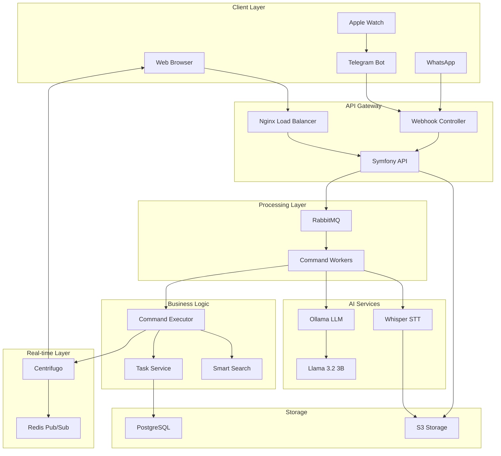
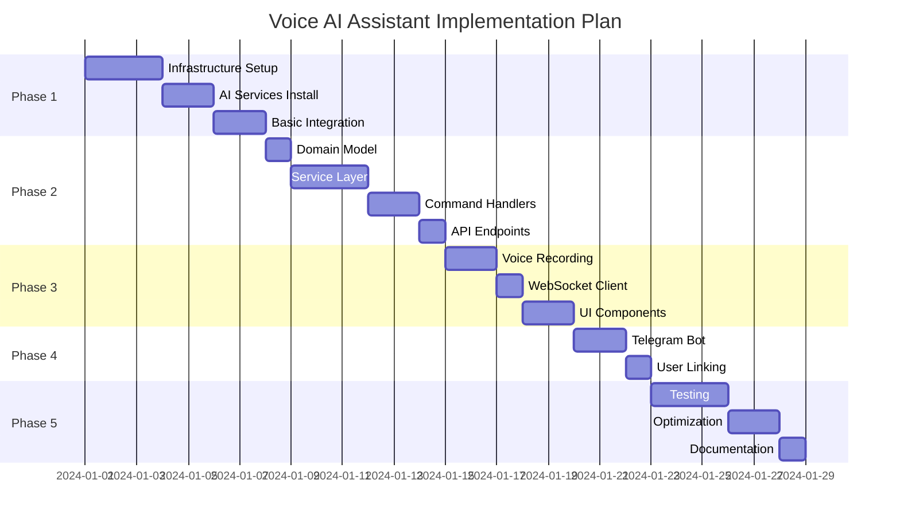

# 🤖 Voice AI Assistant - Enterprise Implementation Guide

> **Version**: 1.0.0
> **Status**: Production-Ready Documentation
> **Target Audience**: Development Team, DevOps, QA Engineers, AI Assistants (Claude, GPT)
> **Estimated Implementation Time**: 19-25 days (full enterprise) | 3-5 days (MVP)
> **Technology Readiness Level**: TRL 6-7

---

## 🎯 Project Context & Business Logic

### What is this project?

This is a **Voice AI Assistant** feature for an existing **Task Management System** (Vue.js 3 + Symfony 7.1 + PostgreSQL). The AI assistant allows users to manage their tasks using natural **Russian language voice commands**, eliminating the need for manual input through UI.

### Core Business Problem

Users waste time navigating complex UIs to create, update, or filter tasks. Our solution: **speak naturally, and the AI does the work**.

**Examples of voice commands:**

1. **"Создай задачу на завтра с 15:00 по 16:30 - Сделать домашнее задание за ребенка, прикрепи теги 'Помощь ребенку', 'Срочные'"**
   → AI creates a task with all specified parameters

2. **"Покажи мне список задач на завтра и послезавтра с приоритетом 'Срочные'"**
   → AI applies filters and displays matching tasks

3. **"Для задачи 'Скопировать чужой контент' добавь три подзадачи - 'Скопировать статью', 'Проанализировать ее', 'Опубликовать на всех ресурсах'"**
   → AI finds the task and creates 3 subtasks

4. **"Для задачи 'Скопировать чужой контент' - отметь подзадачу 'Проанализировать ее' как завершенную"**
   → AI finds task, finds subtask by fuzzy match, marks it complete

5. **"Заверши три задачи на сегодня - 'Задача 1', 'Задача 2' и 'Задача 3'"**
   → AI completes multiple tasks in bulk

6. **"Перенеси оставшиеся незавершенные сегодняшние задачи на завтра!"**
   → AI queries incomplete tasks, updates their due dates

### How it works (Technical Flow)

```
User Action → Voice Recording → Backend API → Queue (RabbitMQ)
                                                    ↓
                                    ← WebSocket ← Processing Worker
                                         ↓              ↓
                                    Frontend      STT (Whisper)
                                                      ↓
                                                 LLM (Llama 3.2)
                                                      ↓
                                                  Parse JSON
                                                      ↓
                                              Execute Command
                                                      ↓
                                            Update Database
```

**Key Technical Requirements:**

1. **Local LLM** (no external APIs): Llama 3.2 3B via Ollama
2. **Runs on weak VPS**: 2 CPU cores, 4GB RAM, 40GB disk
3. **Russian language support**: Both STT (Whisper) and LLM
4. **Real-time updates**: Centrifugo WebSocket
5. **Smart search**: Fuzzy matching for task names (tasks may have similar titles)
6. **Future-ready**: Architecture allows Telegram, WhatsApp, Apple Watch integration

### Architecture Principles

- **SOLID, GRASP, GoF** design patterns throughout
- **Performance-first**: Response time < 5 seconds
- **Scalable**: Easy to add new command types and integrations
- **Testable**: Code designed for Unit, Integration, Functional, E2E tests
- **Privacy-first**: All AI processing happens locally on VPS

---

## 📋 Executive Summary

This comprehensive documentation provides a complete blueprint for implementing an enterprise-grade Voice AI Assistant integrated into the Task Management System. The solution enables natural language voice commands for task management through web interface and messaging platforms, powered by local LLM and speech recognition technologies.

### 🎯 Business Objectives

1. **Productivity Enhancement**: Reduce task creation time by 70% through voice commands
2. **Accessibility**: Enable hands-free task management for mobile and IoT scenarios
3. **Market Differentiation**: First Russian-language voice-powered task manager
4. **Scalability**: Architecture supporting 10,000+ concurrent users
5. **Privacy-First**: All processing happens on-premise, no external API dependencies

### 🏗️ System Architecture Overview



---

## 📚 Documentation Structure

### Phase 1: Infrastructure & Foundation
| Document | Description | Duration | Priority |
|----------|-------------|----------|----------|
| [**1.1 Infrastructure Setup**](01_INFRASTRUCTURE/01_SETUP.md) | Complete infrastructure deployment guide | 2 days | CRITICAL |
| [**1.2 Docker Configuration**](01_INFRASTRUCTURE/02_DOCKER.md) | Docker and docker-compose configurations | 1 day | CRITICAL |
| [**1.3 AI Services Installation**](01_INFRASTRUCTURE/03_AI_SERVICES.md) | Ollama, Whisper, Centrifugo setup | 2 days | CRITICAL |
| [**1.4 Security & Networking**](01_INFRASTRUCTURE/04_SECURITY.md) | Network isolation, SSL, firewall rules | 1 day | HIGH |

### Phase 2: Backend Core Implementation
| Document | Description | Duration | Priority |
|----------|-------------|----------|----------|
| [**2.1 Domain Model**](02_BACKEND/01_DOMAIN_MODEL.md) | Entities, Value Objects, Aggregates | 1 day | CRITICAL |
| [**2.2 Service Layer**](02_BACKEND/02_SERVICES.md) | Core services implementation | 3 days | CRITICAL |
| [**2.3 Command Handlers**](02_BACKEND/03_COMMAND_HANDLERS.md) | Command pattern implementation | 2 days | HIGH |
| [**2.4 API Endpoints**](02_BACKEND/04_API_ENDPOINTS.md) | REST API specification | 1 day | HIGH |
| [**2.5 Queue Processing**](02_BACKEND/05_QUEUE_PROCESSING.md) | RabbitMQ consumers and producers | 2 days | HIGH |
| [**2.6 WebSocket Integration**](02_BACKEND/06_WEBSOCKET.md) | Centrifugo real-time updates | 1 day | MEDIUM |

### Phase 3: Frontend Implementation
| Document | Description | Duration | Priority |
|----------|-------------|----------|----------|
| [**3.1 Voice Recording**](03_FRONTEND/01_VOICE_RECORDING.md) | Audio capture and processing | 2 days | CRITICAL |
| [**3.2 WebSocket Client**](03_FRONTEND/02_WEBSOCKET_CLIENT.md) | Real-time updates handling | 1 day | HIGH |
| [**3.3 UI Components**](03_FRONTEND/03_UI_COMPONENTS.md) | Voice assistant UI elements | 2 days | MEDIUM |
| [**3.4 State Management**](03_FRONTEND/04_STATE_MANAGEMENT.md) | Pinia store for voice commands | 1 day | HIGH |

### Phase 4: Integration Layer
| Document | Description | Duration | Priority |
|----------|-------------|----------|----------|
| [**4.1 Telegram Bot**](04_INTEGRATIONS/01_TELEGRAM.md) | Telegram bot implementation | 2 days | HIGH |
| [**4.2 WhatsApp Integration**](04_INTEGRATIONS/02_WHATSAPP.md) | WhatsApp Business API | 2 days | MEDIUM |
| [**4.3 Apple Watch**](04_INTEGRATIONS/03_APPLE_WATCH.md) | Siri Shortcuts integration | 1 day | LOW |
| [**4.4 OAuth & Linking**](04_INTEGRATIONS/04_OAUTH_LINKING.md) | User account linking | 1 day | HIGH |

### Phase 5: Testing & Optimization
| Document | Description | Duration | Priority |
|----------|-------------|----------|----------|
| [**5.1 Testing Strategy**](05_TESTING/01_STRATEGY.md) | Complete testing approach | 1 day | CRITICAL |
| [**5.2 Unit Tests**](05_TESTING/02_UNIT_TESTS.md) | Unit test implementation | 2 days | HIGH |
| [**5.3 Integration Tests**](05_TESTING/03_INTEGRATION_TESTS.md) | Integration test suite | 2 days | HIGH |
| [**5.4 Performance Tests**](05_TESTING/04_PERFORMANCE.md) | Load and stress testing | 1 day | MEDIUM |
| [**5.5 E2E Tests**](05_TESTING/05_E2E_TESTS.md) | End-to-end test scenarios | 2 days | MEDIUM |

### Phase 6: Deployment & Operations
| Document | Description | Duration | Priority |
|----------|-------------|----------|----------|
| [**6.1 Production Deployment**](06_DEPLOYMENT/01_PRODUCTION.md) | Production deployment guide | 1 day | CRITICAL |
| [**6.2 Monitoring**](06_DEPLOYMENT/02_MONITORING.md) | Metrics, logging, alerting | 1 day | HIGH |
| [**6.3 Scaling Strategy**](06_DEPLOYMENT/03_SCALING.md) | Horizontal and vertical scaling | 1 day | MEDIUM |
| [**6.4 Disaster Recovery**](06_DEPLOYMENT/04_DISASTER_RECOVERY.md) | Backup and recovery procedures | 1 day | HIGH |

### Reference Documentation
| Document | Description | Priority |
|----------|-------------|----------|
| [**API Reference**](REFERENCE/API_REFERENCE.md) | Complete API documentation | HIGH |
| [**DTOs & Contracts**](REFERENCE/DTOS_CONTRACTS.md) | Data transfer objects | HIGH |
| [**Prompts Library**](REFERENCE/PROMPTS_LIBRARY.md) | LLM prompts collection | CRITICAL |
| [**Error Codes**](REFERENCE/ERROR_CODES.md) | Error handling reference | MEDIUM |
| [**Configuration**](REFERENCE/CONFIGURATION.md) | All configuration parameters | HIGH |

---

## 🤖 FOR AI ASSISTANT: Implementation Order

**Follow this EXACT order for MVP implementation:**

### Phase 1: Backend Foundation (Day 1-2)
1. [Domain Model](02_BACKEND/01_DOMAIN_MODEL.md) - Create entities & value objects
2. [Services](02_BACKEND/02_SERVICES.md) - Implement core services
3. [Prompts Library](REFERENCE/PROMPTS_LIBRARY.md) - ⭐ CRITICAL - Read this!

### Phase 2: Backend Processing (Day 2-3)
4. [Command Handlers](02_BACKEND/03_COMMAND_HANDLERS.md) - Handle voice commands
5. [API Endpoints](02_BACKEND/04_API_ENDPOINTS.md) - Create REST API
6. [Queue Processing](02_BACKEND/05_QUEUE_PROCESSING.md) - Async processing

### Phase 3: Frontend (Day 3-4)
7. [Voice Recording](03_FRONTEND/01_VOICE_RECORDING.md) - Record & send audio
8. WebSocket client - Real-time updates (in Voice Recording doc)

### Phase 4: Infrastructure (Day 4-5)
9. [AI Services Setup](01_INFRASTRUCTURE/03_AI_SERVICES.md) - Ollama + Whisper
10. [Security](01_INFRASTRUCTURE/04_SECURITY.md) - Basic security

### Optional (Later)
11. [Telegram Integration](04_INTEGRATIONS/01_TELEGRAM.md) - Telegram bot
12. Testing implementation

---

## 🚀 Quick Start Guide

### Prerequisites Checklist

```bash
# System Requirements
✅ VPS with 4GB RAM minimum (8GB recommended)
✅ Ubuntu 22.04 LTS or similar
✅ Docker 24.0+ and Docker Compose 2.20+
✅ 40GB+ free disk space
✅ Ports: 80, 443, 8089, 8000, 8090, 11434

# Development Tools
✅ PHP 8.3+ with Symfony CLI
✅ Node.js 20+ with npm 10+
✅ Git 2.34+
✅ PostgreSQL client tools
```

### 🏃 30-Minute Quick Setup

```bash
# 1. Clone the repository
git clone [repository-url] task-manager
cd task-manager

# 2. Deploy AI services
cd deployment/ai-services
./deploy.sh --dev

# 3. Initialize models
./scripts/init-models.sh

# 4. Start main application
cd ../../docker
docker-compose up -d

# 5. Run migrations
docker exec backend-php83 php bin/console doctrine:migrations:migrate

# 6. Start frontend
cd ../frontend
npm install && npm run dev

# 7. Verify installation
./scripts/health-check.sh
```

---

## 📊 Technology Stack Details

### Core Technologies

| Component | Technology | Version | Justification |
|-----------|------------|---------|---------------|
| **LLM Runtime** | Ollama | Latest | Best CPU performance, easy deployment |
| **Language Model** | Llama 3.2 3B | Q4_K_M | Optimal for 4GB RAM, Russian support |
| **Speech-to-Text** | Whisper.cpp | v1.5.4 | Fast CPU inference, good Russian |
| **WebSocket** | Centrifugo | v5.0 | Scalable, JWT auth, battle-tested |
| **Queue** | RabbitMQ | 3.12 | Already in stack, reliable |
| **Cache** | Redis | 7.2 | Pub/sub for Centrifugo |
| **Backend** | Symfony | 7.1 | Existing framework |
| **Frontend** | Vue.js | 3.4 | Existing framework |

### AI Model Specifications

```yaml
Llama 3.2 3B:
  Parameters: 3 billion
  Quantization: 4-bit (Q4_K_M)
  Memory Usage: ~2.5GB
  Inference Speed: 200-500ms per request
  Context Window: 8192 tokens
  Languages: Russian, English

Whisper Base:
  Parameters: 74M
  Memory Usage: ~500MB
  Processing Speed: Real-time factor 0.3
  Supported Formats: WAV, MP3, M4A, WebM
  Max Duration: 30 seconds (configurable)
```

---

## 🔐 Security Considerations

### Critical Security Requirements

1. **Authentication & Authorization**
   - JWT tokens with 15-minute expiry
   - Refresh token rotation
   - Rate limiting: 100 requests/minute per user
   - OAuth 2.0 for messenger integrations

2. **Data Protection**
   - All voice files encrypted at rest (AES-256)
   - SSL/TLS for all communications
   - Audio files auto-deleted after processing
   - GDPR compliance for EU users

3. **API Security**
   - Input validation on all endpoints
   - SQL injection prevention via Doctrine ORM
   - XSS protection via Content Security Policy
   - CORS properly configured

4. **Infrastructure Security**
   - Network isolation for AI services
   - Firewall rules (iptables/ufw)
   - Regular security updates
   - Audit logging for all commands

---

## 📈 Performance Targets

### Key Performance Indicators (KPIs)

| Metric | Target | Maximum | Measurement Method |
|--------|--------|---------|-------------------|
| **Voice Command E2E** | < 3s | 8s | User action to UI update |
| **STT Processing** | < 2s | 5s | Audio file to text |
| **LLM Response** | < 500ms | 2s | Text to JSON command |
| **Command Execution** | < 100ms | 500ms | Business logic processing |
| **WebSocket Delivery** | < 50ms | 200ms | Event to client |
| **Concurrent Users** | 1000 | 10000 | Load testing |
| **Audio File Size** | 5MB | 10MB | Per request |
| **Queue Processing** | < 1s | 5s | Message to completion |

### Optimization Strategies

1. **Caching**
   - Redis for frequent commands
   - LLM response caching (5 min TTL)
   - Static prompt compilation

2. **Resource Management**
   - Connection pooling
   - Lazy loading of models
   - Automatic garbage collection

3. **Scaling**
   - Horizontal scaling for API
   - Dedicated AI service nodes
   - CDN for static assets

---

## 🧪 Testing Requirements

### Test Coverage Goals

```yaml
Overall Coverage: 80%

By Layer:
  Domain Logic: 95%
  Service Layer: 90%
  API Endpoints: 85%
  Command Handlers: 90%
  Integration Points: 75%
  UI Components: 70%

By Type:
  Unit Tests: 60%
  Integration Tests: 25%
  E2E Tests: 15%
```

### Critical Test Scenarios

1. **Happy Path Tests**
   - Simple task creation
   - Task completion
   - Filter application
   - Bulk operations

2. **Edge Cases**
   - Ambiguous commands
   - Service timeouts
   - Concurrent requests
   - Large audio files

3. **Error Scenarios**
   - LLM unavailable
   - Invalid audio format
   - Network failures
   - Database locks

---

## 📝 Development Workflow

### Git Branch Strategy

```
main (production)
  ├── develop (staging)
  │   ├── feature/voice-ai-phase-1
  │   ├── feature/voice-ai-phase-2
  │   └── feature/voice-ai-phase-3
  └── hotfix/critical-bug
```

### Code Review Checklist

- [ ] SOLID principles followed
- [ ] Unit tests written and passing
- [ ] Documentation updated
- [ ] Performance impact assessed
- [ ] Security review completed
- [ ] Error handling implemented
- [ ] Logging added
- [ ] Configuration externalized

---

## 🚨 Risk Management

### Identified Risks & Mitigations

| Risk | Impact | Probability | Mitigation |
|------|--------|-------------|------------|
| **VPS Resources Insufficient** | HIGH | MEDIUM | Implement resource monitoring, prepare scaling plan |
| **LLM Hallucinations** | HIGH | LOW | Strict JSON validation, confidence thresholds |
| **Network Latency** | MEDIUM | MEDIUM | Implement retries, offline mode |
| **Model Download Failure** | HIGH | LOW | Pre-download models, backup mirrors |
| **Concurrent Request Overload** | HIGH | MEDIUM | Queue system, rate limiting |
| **Security Breach** | CRITICAL | LOW | Regular audits, encryption, monitoring |

---

## 📞 Support & Troubleshooting

### Common Issues Quick Reference

1. **Ollama not responding**
   ```bash
   docker restart voice-ai-ollama
   docker logs -f voice-ai-ollama --tail 100
   ```

2. **Whisper accuracy issues**
   ```bash
   # Check model size
   docker exec voice-ai-whisper ls -la /models
   # Upgrade to larger model if needed
   ```

3. **WebSocket connection drops**
   ```bash
   # Check Centrifugo status
   curl http://localhost:8000/health
   # Review JWT token expiry
   ```

### Monitoring Commands

```bash
# System resources
htop
docker stats

# Service health
curl http://localhost:11434/api/tags     # Ollama models
curl http://localhost:8090/health        # Whisper status
curl http://localhost:8000/stats        # Centrifugo stats

# Logs
docker-compose logs -f ollama
docker-compose logs -f whisper
docker-compose logs -f centrifugo
```

---

## 🎯 Success Criteria

### Minimum Viable Product (MVP)

- ✅ Voice command processing in Russian
- ✅ Basic task operations (create, complete, list)
- ✅ Real-time UI updates via WebSocket
- ✅ Response time under 5 seconds
- ✅ 95% command recognition accuracy
- ✅ Support for 100 concurrent users

### Production Release

- ✅ All MVP features
- ✅ Telegram bot integration
- ✅ Advanced search capabilities
- ✅ Bulk operations support
- ✅ 99.9% uptime SLA
- ✅ Complete test coverage
- ✅ Monitoring and alerting
- ✅ Disaster recovery plan

---

## 📅 Implementation Timeline



---

## 🔗 Next Steps

1. **Review this documentation** with all stakeholders
2. **Set up development environment** following [Infrastructure Setup](01_INFRASTRUCTURE/01_SETUP.md)
3. **Begin Phase 1 implementation** with infrastructure deployment
4. **Schedule daily standup meetings** for progress tracking
5. **Create JIRA tickets** for each implementation task

---

## 📖 References

### External Documentation
- [Ollama Documentation](https://github.com/ollama/ollama)
- [Whisper.cpp Guide](https://github.com/ggerganov/whisper.cpp)
- [Centrifugo Documentation](https://centrifugal.dev/)
- [Llama Model Card](https://ai.meta.com/llama/)

### Internal Documentation
- [Project Overview](../PROJECT_OVERVIEW.md)
- [Backend Architecture](../backend/ARCHITECTURE.md)
- [API Reference](../backend/API_REFERENCE.md)
- [Development Workflow](../guides/DEVELOPMENT_WORKFLOW.md)

---

**Document Version**: 1.0.0
**Last Updated**: 2025-11-08
**Author**: AI Architecture Team
**Review Status**: Ready for Implementation