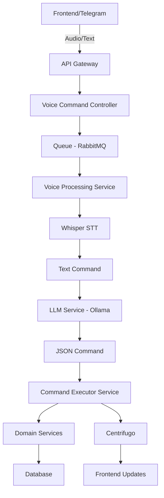

# 🎙️ Voice AI Assistant - Детальный План Реализации

> **Дата создания**: 2025-11-08
> **Автор**: Claude Code (Opus 4.1)
> **Статус**: План утвержден

## 📋 Оглавление

1. [Технологический Стек](#технологический-стек)
2. [Архитектура Системы](#архитектура-системы)
3. [План Реализации по Фазам](#план-реализации-по-фазам)
4. [Детальная Реализация по Компонентам](#детальная-реализация-по-компонентам)
5. [Критические Точки для Тестирования](#критические-точки-для-тестирования)
6. [Будущее Масштабирование](#будущее-масштабирование)

---

## 🚀 Технологический Стек

### Выбранные технологии:

| Компонент | Технология | Обоснование |
|-----------|------------|-------------|
| **LLM** | Llama 3.2 3B (4-bit квантование) | Оптимальный баланс производительности и качества для слабого VPS |
| **LLM Runtime** | Ollama | Простой деплой, REST API из коробки, управление памятью |
| **Speech-to-Text** | Whisper.cpp (локально) | Бесплатно, приватно, хорошее качество русского языка |
| **WebSocket** | Centrifugo | Масштабируемый, JWT авторизация, готовые клиенты |
| **Мессенджеры** | Telegram (первая очередь) | Популярность в РФ/СНГ, простое API |
| **Queue** | RabbitMQ (уже есть) | Для асинхронной обработки голосовых команд |

---

## 🏗️ Архитектура Системы

### Общий Flow обработки голосовых команд:



### Компоненты системы:

1. **Frontend Layer**
   - Voice Recorder Component (Vue.js)
   - WebSocket Client (Centrifugo)
   - Real-time UI Updates

2. **API Layer**
   - VoiceCommandController
   - WebSocket Publisher Service
   - Telegram Webhook Controller

3. **Processing Layer**
   - STT Service (Whisper)
   - LLM Service (Ollama + Llama)
   - Command Parser Service

4. **Business Layer**
   - Command Executor Service
   - Task Service (existing)
   - Filter Service
   - Analytics Service

5. **Infrastructure Layer**
   - RabbitMQ (async processing)
   - Centrifugo (WebSocket)
   - PostgreSQL (storage)

---

## 📅 План Реализации по Фазам

### Phase 1: Инфраструктура и Базовая Интеграция (3-4 дня)

#### 1.1 Установка и настройка Ollama (День 1)
- [ ] Установка Ollama на VPS
- [ ] Загрузка и настройка Llama 3.2 3B модели
- [ ] Создание LLMService для интеграции с Ollama API
- [ ] Написание промптов для парсинга команд в JSON

#### 1.2 Установка и настройка Whisper (День 1-2)
- [ ] Установка whisper.cpp на VPS
- [ ] Создание STTService для интеграции
- [ ] Оптимизация для русского языка
- [ ] Тестирование производительности

#### 1.3 Настройка Centrifugo (День 2-3)
- [ ] Установка Centrifugo через Docker
- [ ] Интеграция JWT авторизации
- [ ] Создание WebSocketPublisherService
- [ ] Настройка каналов для пользователей

#### 1.4 Базовая архитектура Backend (День 3-4)
- [ ] Создание VoiceCommand Entity
- [ ] VoiceCommandController
- [ ] Настройка RabbitMQ очередей
- [ ] Базовый CommandExecutorService

### Phase 2: Backend Core Implementation (5-6 дней)

#### 2.1 Voice Processing Pipeline (День 4-5)
```php
namespace App\Service\VoiceAssistant;

interface VoiceProcessingServiceInterface {
    public function processAudioFile(UploadedFile $audio, User $user): VoiceCommand;
    public function processTextCommand(string $text, User $user): VoiceCommand;
}
```

#### 2.2 LLM Integration Service (День 5-6)
```php
namespace App\Service\VoiceAssistant;

interface LLMServiceInterface {
    public function parseCommand(string $text, array $context): CommandDto;
    public function generateResponse(CommandResult $result): string;
}
```

#### 2.3 Command Parser & Router (День 6-7)
```php
namespace App\Service\VoiceAssistant\Command;

interface CommandParserInterface {
    public function parse(string $llmResponse): ParsedCommand;
    public function validate(ParsedCommand $command): bool;
}

interface CommandRouterInterface {
    public function route(ParsedCommand $command): CommandHandlerInterface;
}
```

#### 2.4 Command Handlers (День 7-9)
- [ ] CreateTaskCommandHandler
- [ ] UpdateTaskCommandHandler
- [ ] CompleteTaskCommandHandler
- [ ] FilterTasksCommandHandler
- [ ] CreateSubtasksCommandHandler
- [ ] BulkOperationsCommandHandler

#### 2.5 Smart Search Service (День 9)
```php
namespace App\Service\VoiceAssistant;

interface SmartSearchServiceInterface {
    public function findTaskByDescription(string $description, User $user): ?Task;
    public function findSimilarTasks(string $query, User $user, int $limit = 5): array;
    public function scoreMatch(Task $task, string $query): float;
}
```

### Phase 3: Frontend Implementation (4-5 дней)

#### 3.1 Voice Recording Component (День 10-11)
```typescript
// composables/useVoiceRecording.ts
interface VoiceRecordingComposable {
    isRecording: Ref<boolean>
    audioBlob: Ref<Blob | null>
    startRecording(): Promise<void>
    stopRecording(): Promise<void>
    sendToBackend(): Promise<VoiceCommandResult>
}
```

#### 3.2 WebSocket Integration (День 11-12)
```typescript
// services/centrifugo.service.ts
interface CentrifugoService {
    connect(token: string): Promise<void>
    subscribe(channel: string, handler: (data: any) => void): void
    disconnect(): void
}
```

#### 3.3 UI Components (День 12-13)
- [ ] VoiceAssistantButton.vue
- [ ] VoiceCommandHistory.vue
- [ ] CommandProcessingIndicator.vue
- [ ] VoiceCommandResults.vue

#### 3.4 State Management (День 13-14)
```typescript
// stores/voiceAssistant.store.ts
interface VoiceAssistantStore {
    commands: VoiceCommand[]
    isProcessing: boolean
    currentTranscription: string
    processVoiceCommand(audio: Blob): Promise<void>
    processTextCommand(text: string): Promise<void>
}
```

### Phase 4: Telegram Integration (3 дня)

#### 4.1 Telegram Bot Setup (День 14-15)
```php
namespace App\Service\Integration\Telegram;

interface TelegramBotServiceInterface {
    public function handleWebhook(array $update): void
    public function processVoiceMessage(array $message): void
    public function sendResponse(int $chatId, string $text): void
}
```

#### 4.2 User Linking System (День 15-16)
- [ ] Telegram аутентификация через код
- [ ] Связывание Telegram ID с User
- [ ] Синхронизация контекста пользователя

#### 4.3 Command Processing (День 16)
- [ ] Адаптация voice pipeline для Telegram
- [ ] Форматирование ответов для Telegram
- [ ] Обработка inline keyboard для подтверждений

### Phase 5: Optimization & Polish (2-3 дня)

#### 5.1 Performance Optimization (День 17)
- [ ] Кеширование LLM responses
- [ ] Батчинг команд
- [ ] Оптимизация промптов
- [ ] Database query optimization

#### 5.2 Error Handling (День 18)
- [ ] Graceful degradation
- [ ] Retry механизмы
- [ ] User feedback при ошибках
- [ ] Логирование и мониторинг

#### 5.3 Testing & Documentation (День 19)
- [ ] Integration tests для pipeline
- [ ] E2E тесты основных сценариев
- [ ] API документация
- [ ] User guide

---

## 🔧 Детальная Реализация по Компонентам

### 1. Backend Structure

```
backend/src/
├── Controller/
│   ├── VoiceCommandController.php
│   └── Integration/
│       └── TelegramWebhookController.php
├── Service/
│   └── VoiceAssistant/
│       ├── VoiceProcessingService.php
│       ├── STTService.php
│       ├── LLMService.php
│       ├── CommandParserService.php
│       ├── CommandExecutorService.php
│       ├── SmartSearchService.php
│       ├── WebSocketPublisherService.php
│       ├── Command/
│       │   ├── Handlers/
│       │   │   ├── CreateTaskCommandHandler.php
│       │   │   ├── UpdateTaskCommandHandler.php
│       │   │   ├── CompleteTaskCommandHandler.php
│       │   │   ├── FilterTasksCommandHandler.php
│       │   │   └── BulkOperationsCommandHandler.php
│       │   └── CommandHandlerInterface.php
│       └── Integration/
│           └── TelegramBotService.php
├── Entity/
│   ├── VoiceCommand.php
│   └── UserTelegramLink.php
├── Repository/
│   ├── VoiceCommandRepository.php
│   └── UserTelegramLinkRepository.php
├── Dto/
│   └── VoiceAssistant/
│       ├── ParsedCommandDto.php
│       ├── CommandResultDto.php
│       └── LLMResponseDto.php
├── Message/
│   └── ProcessVoiceCommandMessage.php
└── MessageHandler/
    └── ProcessVoiceCommandHandler.php
```

### 2. LLM Prompt Engineering

```yaml
# Промпт для Llama 3.2
system_prompt: |
  Ты - ассистент для управления задачами. Преобразуй голосовые команды пользователя в JSON.

  Доступные действия:
  - create_task: создание новой задачи
  - update_task: обновление существующей задачи
  - complete_task: завершение задачи
  - filter_tasks: фильтрация и поиск задач
  - create_subtasks: создание подзадач
  - bulk_operation: массовые операции

  Формат ответа - ТОЛЬКО валидный JSON:
  {
    "action": "action_name",
    "parameters": {
      // параметры в зависимости от действия
    },
    "confidence": 0.0-1.0
  }

user_prompt: |
  Команда пользователя: "{user_input}"

  Контекст:
  - Текущая дата: {current_date}
  - Часовой пояс: {timezone}
  - Активные задачи пользователя: {active_tasks_summary}
```

### 3. WebSocket Events Structure

```typescript
// Типы WebSocket событий
enum VoiceAssistantEvent {
  COMMAND_RECEIVED = 'voice.command.received',
  PROCESSING_STARTED = 'voice.processing.started',
  TRANSCRIPTION_READY = 'voice.transcription.ready',
  COMMAND_PARSED = 'voice.command.parsed',
  ACTION_EXECUTED = 'voice.action.executed',
  ERROR_OCCURRED = 'voice.error',
}

interface WebSocketMessage<T = any> {
  event: VoiceAssistantEvent
  timestamp: number
  data: T
  userId: string
}
```

### 4. Database Schema

```sql
-- Voice Commands History
CREATE TABLE voice_commands (
    id UUID PRIMARY KEY DEFAULT gen_random_uuid(),
    user_id UUID NOT NULL REFERENCES users(id),
    audio_file_path VARCHAR(255),
    transcription TEXT NOT NULL,
    parsed_command JSONB NOT NULL,
    command_result JSONB,
    status VARCHAR(50) NOT NULL, -- pending, processing, completed, failed
    source VARCHAR(50) NOT NULL, -- web, telegram, whatsapp, etc
    processing_time_ms INTEGER,
    created_at TIMESTAMP NOT NULL DEFAULT NOW(),
    updated_at TIMESTAMP NOT NULL DEFAULT NOW()
);

-- User Telegram Links
CREATE TABLE user_telegram_links (
    id UUID PRIMARY KEY DEFAULT gen_random_uuid(),
    user_id UUID NOT NULL REFERENCES users(id),
    telegram_id BIGINT NOT NULL UNIQUE,
    telegram_username VARCHAR(255),
    first_name VARCHAR(255),
    last_name VARCHAR(255),
    language_code VARCHAR(10),
    is_active BOOLEAN DEFAULT true,
    linked_at TIMESTAMP NOT NULL DEFAULT NOW(),
    last_used_at TIMESTAMP
);

-- Indexes for performance
CREATE INDEX idx_voice_commands_user_status ON voice_commands(user_id, status);
CREATE INDEX idx_voice_commands_created ON voice_commands(created_at DESC);
CREATE INDEX idx_telegram_links_telegram_id ON user_telegram_links(telegram_id);
```

---

## 🧪 Критические Точки для Тестирования

### Backend - Приоритетные области для тестов:

1. **VoiceProcessingService**
   - Обработка различных форматов аудио
   - Handling больших файлов
   - Timeout handling

2. **LLMService**
   - Парсинг различных типов команд
   - Обработка неоднозначных запросов
   - Fallback при недоступности Ollama

3. **CommandExecutorService**
   - Транзакционность операций
   - Rollback при ошибках
   - Конкурентные команды от одного пользователя

4. **SmartSearchService**
   - Точность поиска задач
   - Производительность на больших датасетах
   - Обработка опечаток и синонимов

5. **WebSocket Integration**
   - Reconnection logic
   - Message delivery гарантии
   - Обработка offline пользователей

### Test Coverage Strategy:

```php
// Unit Tests (70% coverage)
- Services logic
- Command handlers
- DTO transformations

// Integration Tests (20% coverage)
- API endpoints
- Database operations
- External services mocking

// Functional Tests (10% coverage)
- Complete voice command flow
- WebSocket real-time updates
- Telegram bot interactions
```

---

## 🚀 Будущее Масштабирование

### 1. Multi-Messenger Architecture

```yaml
Planned Integrations:
  Phase 2:
    - WhatsApp Business API
    - Apple Shortcuts (через webhook)
    - Google Assistant (через Actions)

  Phase 3:
    - Slack
    - Discord
    - Microsoft Teams

  Phase 4:
    - VK
    - Viber
    - Custom REST API для IoT устройств
```

### 2. Horizontal Scaling Plan

```yaml
Components:
  API Gateway:
    - Load Balancer (nginx)
    - Multiple API instances

  Processing:
    - Queue workers auto-scaling
    - Distributed Ollama instances

  WebSocket:
    - Centrifugo cluster
    - Redis for pub/sub

  Storage:
    - PostgreSQL read replicas
    - Redis cache cluster
```

### 3. Advanced Features Roadmap

1. **Context Awareness**
   - История команд пользователя
   - Персонализированные промпты
   - Обучение на feedback

2. **Multi-language Support**
   - Английский язык
   - Автоопределение языка
   - Перевод команд

3. **Voice Responses**
   - TTS интеграция
   - Голосовые уведомления
   - Voice-first interface option

4. **AI Improvements**
   - Fine-tuning Llama на датасете команд
   - A/B тестирование промптов
   - Автоматическая коррекция ошибок

---

## 📝 Следующие Шаги

1. **Утвердить план** - Подтвердите, что план соответствует вашим ожиданиям
2. **Приоритезация фаз** - Определить, какие части критичны для MVP
3. **Начать Phase 1** - Установка инфраструктуры
4. **Создать test environment** - Отдельный VPS для тестирования

---

## 🔗 Связанные документы

- [Backend Architecture](../backend/ARCHITECTURE.md)
- [API Reference](../backend/API_REFERENCE.md)
- [Development Workflow](DEVELOPMENT_WORKFLOW.md)
- [Testing Guide](TESTING.md)

---

**Автор**: Claude Code (Opus 4.1)
**Дата создания**: 2025-11-08
**Версия**: 1.0.0